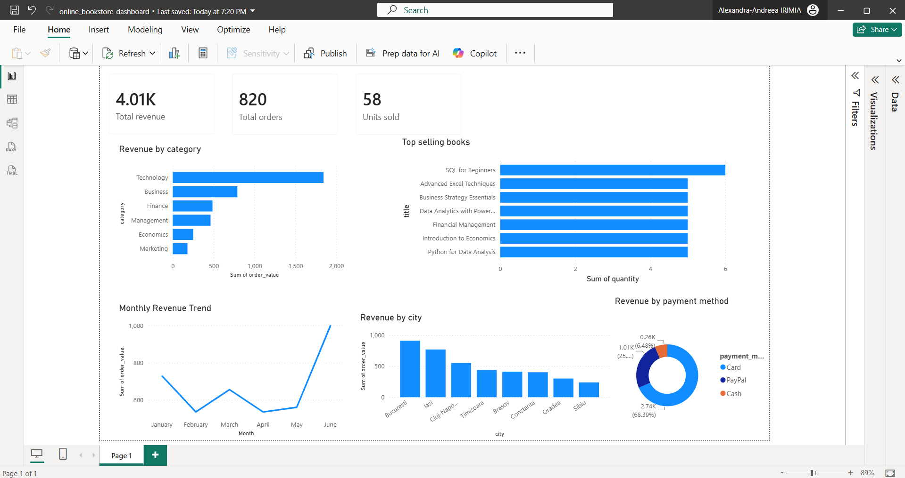

# Online Bookstore — SQL & Power BI Dashboard

Proiect de analiză a vânzărilor unei librării online: bază de date relațională în PostgreSQL, interogări analitice și un dashboard Power BI pentru vizualizarea veniturilor, cărților vândute și comportamentului clienților.

## Fișiere din proiect

| Fișier | Descriere |
|---|---|
| `online_bookstore-tables.sql` | Schema bazei de date (definiții tabele) |
| `online_bookstore-values.sql` | Date de test (INSERT-uri) |
| `online_bookstore-query.sql` | Interogări analitice folosite pentru raport |
| `online_bookstore-dashboard.pbix` | Fișierul Power BI (raport + model de date) |
| `online_bookstore-overview.png` | Captură de ecran cu dashboard-ul final |

## Schema bazei de date

Trei tabele legate prin chei străine:

**`customers`**
| Coloană | Tip | Descriere |
| `customer_id` | SERIAL PK | Identificator client |
| `customer_name` | VARCHAR(100) | Numele clientului |
| `city` | VARCHAR(50) | Orașul |
| `age` | INTEGER | Vârsta |
| `email` | VARCHAR(100) | Email |

**`books`**
| Coloană | Tip | Descriere |
|---|---|---|
| `book_id` | SERIAL PK | Identificator carte |
| `title` | VARCHAR(150) | Titlul |
| `author` | VARCHAR(80) | Autorul |
| `category` | VARCHAR(80) | Categoria (Technology, Business, Finance, Economics, Management, Marketing) |
| `price` | NUMERIC(10,2) | Preț unitar |

**`orders`**
| Coloană | Tip | Descriere |
|---|---|---|
| `order_id` | SERIAL PK | Identificator comandă |
| `customer_id` | INTEGER FK → customers | Clientul care a comandat |
| `book_id` | INTEGER FK → books | Cartea comandată |
| `order_date` | DATE | Data comenzii |
| `quantity` | INTEGER | Cantitatea |
| `payment_method` | VARCHAR(50) | Metoda de plată (Card, PayPal, Cash) |

## Date de test

- **15 clienți** din orașe diferite (Iași, București, Cluj-Napoca, Timișoara, Brașov, Constanța, Sibiu, Oradea)
- **15 cărți** în 6 categorii, preț între 50 și 90 lei
- **40 de comenzi** plasate între ianuarie și iunie 2026

## Interogări incluse (`online_bookstore-query.sql`)

- Total comenzi și venit total
- Venit pe categorie de carte
- Cele mai vândute cărți (după cantitate)
- Top clienți după suma cheltuită (inclusiv top 5)
- Vânzări pe lună
- Valoarea medie a unei comenzi

## Conținutul dashboard-ului (Page 1)

**KPI carduri**
- Total revenue: 4.01K
- Total orders: 820
- Units sold: 58

**Vizualizări**
- **Revenue by category** – bară orizontală; Technology generează cel mai mare venit, urmat de Business, Finance, Management, Economics și Marketing.
- **Top selling books** – bară orizontală (procentual); "SQL for Beginners" este titlul cu cele mai multe vânzări.
- **Monthly Revenue Trend** – linie ianuarie–iunie 2026; scădere în februarie, apoi creștere accentuată spre iunie.
- **Revenue by city** – bară verticală pe orașe; București generează cel mai mult venit, urmat de Iași.
- **Revenue by payment method** – donut; Card domină clar (68.39%), urmat de PayPal (25%) și Cash (6.48%).

## Observații / insight-uri rapide
- Categoria **Technology** este principalul generator de venit — coerent cu faptul că majoritatea titlurilor cele mai vândute (SQL, Excel, Python, Data Analytics) aparțin acestei categorii.
- **Cardul** este metoda de plată dominantă, folosită în peste două treimi din tranzacții.
- Veniturile au avut un vârf clar în **iunie**, după o scădere în februarie — util pentru identificarea sezonalității.
- **București și Iași** aduc cel mai mult venit, ceea ce poate ghida campanii de marketing regionale.

## Posibile extinderi
- Analiză cohortă pentru clienți recurenți vs. noi.
- Calcul marjă/profit dacă se adaugă cost per carte.
- Migrarea sursei Power BI de la fișiere statice la conexiune live PostgreSQL.
